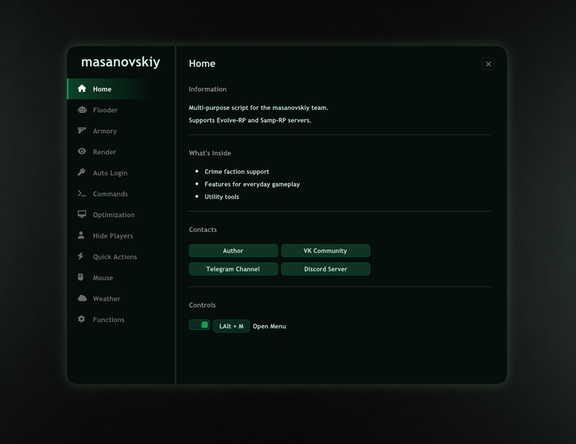

# masanovskiy-helper

A multifunctional MoonLoader helper for SA-MP with gameplay tools, crime-faction features, and server-specific support for Evolve-RP and Samp-RP.

## Preview

  

## Features

* Flooder and chat tools
* Armory, safe, and warehouse helpers
* On-screen renders, checkers, and zone lines
* Auto-login system
* Custom commands and quick actions
* Performance and rendering settings
* Player hiding and mouse controls
* Crafting and weather tools
* Configurable hotkeys and in-game settings

## Requirements

* Grand Theft Auto: San Andreas
* SA-MP
* MoonLoader
* SAMPFUNCS

## Installation

1. Download `masanovskiy.lua`.
2. Place it into your `moonloader` folder.
3. Start the game and connect to a supported server.
4. On first launch, missing dependencies will be downloaded automatically.

## Usage

* Open the menu with `Left Alt + M`.
* Or use the `/masan` command.
* Configure hotkeys and features directly in the in-game menu.

## Supported servers

* Evolve-RP
* Samp-RP

## Notes

* Configuration is created automatically.
* Some features are server-specific.
